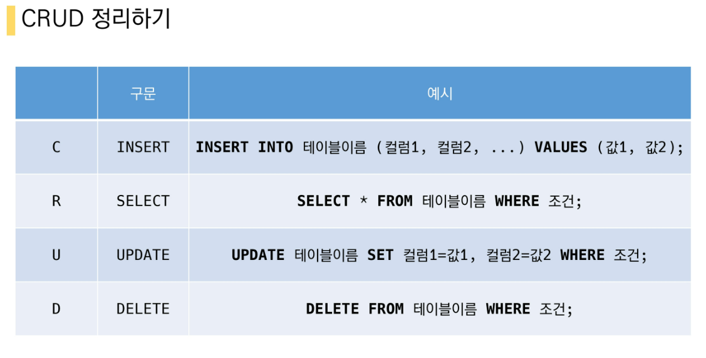
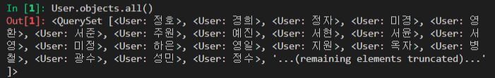
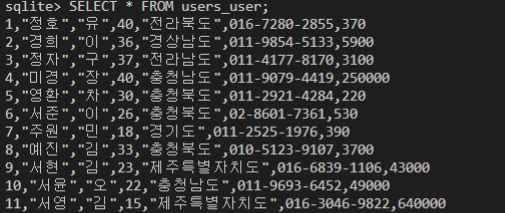
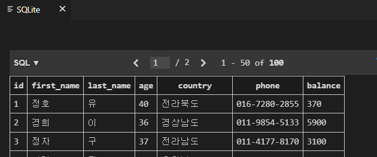
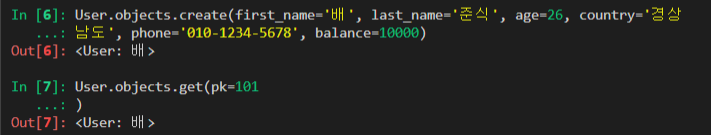
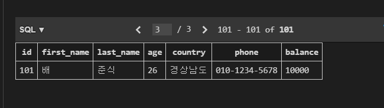
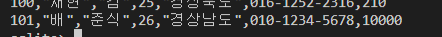
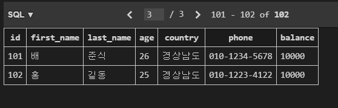

[TOC]

# SQL with django ORM

## 기본 준비 사항

* django app

  * 가상환경 세팅

  * 패키지 설치

  * migrate

    ```bash
    $ python manage.py migrate
    ```
  
* 제공 받은 `users.csv` 파일은 db.sqlite3와 같은 곳에 위치하도록 이동

* `db.sqlite3` 활용

  * `sqlite3`  실행

    ```bash
    $ sqlite3 db.sqlite3
    ```

  * 테이블 확인

    ```sqlite
    sqlite > .tables
    auth_group                  django_admin_log
    auth_group_permissions      django_content_type
    auth_permission             django_migrations
    auth_user                   django_session
    auth_user_groups            auth_user_user_permissions  
    users_user
    ```
    
  * csv 파일 data 로드 및 확인

    ```sqlite
    sqlite > .mode csv
    sqlite > .import users.csv users_user
    
    sqlite > SELECT COUNT(*) FROM users_user;
    100
    ```



---


## 문제

> ORM은 django extensions의 shell_plus에서,
>
> SQL은 수업에서 진행한 [SQLite 확장프로그램](https://marketplace.visualstudio.com/items?itemName=alexcvzz.vscode-sqlite) 사용 방식으로 진행

### 1. 기본 CRUD 로직

1. 모든 user 레코드 조회

   ```python
   # orm
   User.objects.all()
   ```

   


      ```sql
   -- sql
   sqlite> SELECT * FROM users_user;
      ```

   

2. user 레코드 생성



확인해 보면 first_name, last_name, age, country, phone, balance가 있다.

```python
# orm
User.objects.create(first_name='배', last_name='준식', age=26, country='경상 
   ...: 남도', phone='010-1234-5678', balance=10000)
<User: 배>
## balnace를 빼고 작성해보았다
NOT NULL constraint failed: users_user.balance 이런 오류가 나온다.
```



어 근데 이러면 



이미 101번이 있어서 sql에서도 확인



여기도 있네 ㅎ

쨋든 sql로 user레코드를 생성해보자


### 단 컬럼명을 명시하지 않고 싶다면 아이디값도 넣어줘야 합니다.

```sql
-- sql
sqlite> INSERT INTO users_user VALUES ('홍', '길동', 25, '경상남도', '010-1223-4122', 10000)
   ...> ;
Parse error: table users_user has 7 columns but 6 values were supplied
# id값을 안주어서 그런거같다. id값 102주고 다시
sqlite> INSERT INTO users_user VALUES (102, '홍', '길동', 25, '경상남도', '010-1223-4122', 10000);
```



* 하나의 레코드를 빼고 작성 후 `NOT NULL` constraint 오류를 orm과 sql에서 모두 확인 해보세요.

1. 해당 user 레코드 조회

   - `102` 번 id의 전체 레코드 조회

   ```python
   # orm
   In [22]: User.objects.filter(pk=102).values()
   Out[22]: <QuerySet [{'id': 102, 'first_name': '홍', 'last_name': '길동', 'age': 25, 'country': '경상남도', 'phone': '010-1223-4122', 'balance': 10000}]>
   ```

   ```sql
   -- sql
   sqlite> SELECT * FROM users_user WHERE id=102;
   102,"홍","길동",25,"경상남도",010-1223-4122,10000
   ```

2. 해당 user 레코드 수정

   - ORM: `102` 번 글의 `last_name` 을 '김' 으로 수정
   - SQL: `102` 번 글의 `first_name` 을 '철수' 로 수정

   ```python
   # orm
    user = User.objects.get(pk=102)
   
   In [26]: user.last_name
   Out[26]: '길동'
   
   In [27]: user.last_name='김'
   
   In [28]: user.save()
   
   In [29]: user.last_name
   Out[29]: '김'
   ```

   

      ```sql
   -- sql
   sqlite> UPDATE users_user SET 'first_name' = '철수' WHERE id=102;
      ```

   

3. 해당 user 레코드 삭제

   - ORM: `102` 번 글 삭제
   - `SQL`:  `101` 번 글 삭제 

   ```python
   # orm
   In [30]: User.objects.get(pk=102).delete()
   Out[30]: (1, {'users.User': 1})
   ```

   ```sql
   -- sql
   DELETE FROM users_user WHERE id=101;
   ```


---


### 2. 조건에 따른 쿼리문

1. 전체 인원 수 

   - `User` 의 전체 인원수

   ```python
   # orm
   In [31]: len(User.objects.all())
   Out[31]: 100
   ```

   ```sql
   -- sql
   sqlite> SELECT COUNT(*) FROM users_user;
   100
   ```

2. 나이가 30인 사람의 이름

   - `ORM` : `.values` 활용
     - 예시: `User.objects.filter(조건).values(컬럼이름)`

   ```python
   # orm
   In [34]: User.objects.filter(age=30).values('first_name')
   Out[34]: <QuerySet [{'first_name': '영환'}, {'first_name': '보람'}, {'first_name': '은
   영'}]>
   ```

      ```sql
   -- sql
   sqlite> SELECT first_name FROM users_user WHERE age =30;
   "영환"
   "보람"
   "은영"
      ```

3. 나이가 30살 이상인 사람의 인원 수

   -  ORM: `__gte` , `__lte` , `__gt`, `__lt` -> 대소관계 활용

   ```python
   # orm
   In [36]: len(User.objects.filter(age__gte=30))
   Out[36]: 43
   ```

      ```sql
   -- sql
   sqlite> SELECT COUNT(*) FROM users_user WHERE age >=30;
   43
      ```

4. 나이가 20살 이하인 사람의 인원 수 

   ```python
   # orm
   In [37]: len(User.objects.filter(age__lte=20))
   Out[37]: 23
   ```

   ```sql
   -- sql
   sqlite> SELECT COUNT(*) FROM users_user WHERE age <= 20;
   23
   ```

5. 나이가 30이면서 성이 김씨인 사람의 인원 수

   ```python
   # orm
   In [38]: len(User.objects.filter(age=30, last_name='김'))
   Out[38]: 1
   ```

      ```sql
   -- sql
   sqlite> SELECT COUNT(*) FROM users_user WHERE age =30 and last_name='김';
   1
      ```

6. 나이가 30이거나 성이 김씨인 사람?

   ```python
   # orm
   In [42]: len(User.objects.filter(age=30))+ len(User.objects.filter(last_name='김'))-le 
       ...: n(User.objects.filter(age=30, last_name='김'))
   Out[42]: 25
   ### 이방법은 좀 아닌거같다 
   # or 이런게 없을까??? ---> | 이것이 or 역확을 하는것 같다.
   In [44]: len(User.objects.filter(age=30)|User.objects.filter(last_name='김'))
   Out[44]: 25
   ```

   ```sql
   -- sql
   sqlite> SELECT COUNT(*) FROM users_user WHERE age =30 OR last_name='김';
   25
   ```

7. 지역번호가 02인 사람의 인원 수

   - `ORM`: `__startswith` 

   ```python
   # orm
   In [45]: len(User.objects.filter(phone__startswith='02'))
   Out[45]: 24
   ```

      ```sql
   -- sql
   sqlite> SELECT COUNT(*) FROM users_user WHERE phone LIKE '02%';
   24
      ```

8. 거주 지역이 강원도이면서 성이 황씨인 사람의 이름

   ```python
   # orm
   In [46]: User.objects.filter(country='강원도', last_name='황').values('first_name')    
   Out[46]: <QuerySet [{'first_name': '은정'}]>
   ```
   
      ```sql
   -- sql
   sqlite> SELECT first_name FROM users_user WHERE country='강원도' and last_name='황';
   "은정"
      ```


---


### 3. 정렬 및 LIMIT, OFFSET

1. 나이가 많은 사람순으로 10명

   ```python
   # orm
   In [49]: User.objects.order_by('-age')[:10].values()
   Out[49]: <QuerySet [{'id': 1, 'first_name': '정호', 'last_name': '유', 'age': 40, 'country': '전라북도', 'phone': '016-7280-2855', 'balance': 370}, {'id': 4, 'first_name': ' 
   미경', 'last_name': '장', 'age': 40, 'country': '충청남도', 'phone': '011-9079-4419', 'balance': 250000}, {'id': 28, 'first_name': '성현', 'last_name': '박', 'age': 40, 'country': '경상남도', 'phone': '011-2884-6546', 'balance': 580000}, {'id': 53, 'first_name': '상훈', 'last_name': '홍', 'age': 40, 'country': '전라북도', 'phone': '016-7698-6684', 'balance': 550}, {'id': 65, 'first_name': '민서', 'last_name': '송', 'age': 40, 'country': '경기도', 'phone': '011-9812-5681', 'balance': 51000}, {'id': 26, 'first_name': '영식', 'last_name': '이', 'age': 39, 'country': '경상북도', 'phone': '016-2645-6128', 'balance': 400000}, {'id': 55, 'first_name': '미경', 'last_name': '이', 'age': 39, 'country': '경기도', 'phone': '02-6697-3997', 'balance': 890000}, {'id': 58, 'first_name': '영일', 'last_name': '배', 'age': 39, 'country': '전라남도', 'phone': '010-3486-8085', 'balance': 280000}, {'id': 74, 'first_name': '승민', 'last_name': '배', 'age': 39, 'country': '강원도', 'phone': '010-4833-9657', 'balance': 840}, {'id': 82, 'first_name': '현
   지', 'last_name': '김', 'age': 39, 'country': '충청북도', 'phone': '02-8468-8321', 'balance': 680000}]>
   ```

      ```sql
   -- sql
   sqlite> SELECT * FROM users_user ORDER BY age DESC LIMIT 10;
   1,"정호","유",40,"전라북도",016-7280-2855,370
   4,"미경","장",40,"충청남도",011-9079-4419,250000
   28,"성현","박",40,"경상남도",011-2884-6546,580000
   53,"상훈","홍",40,"전라북도",016-7698-6684,550
   65,"민서","송",40,"경기도",011-9812-5681,51000
   26,"영식","이",39,"경상북도",016-2645-6128,400000
   55,"미경","이",39,"경기도",02-6697-3997,890000
   58,"영일","배",39,"전라남도",010-3486-8085,280000
   74,"승민","배",39,"강원도",010-4833-9657,840
   82,"현지","김",39,"충청북도",02-8468-8321,680000
      ```

2. 잔액이 적은 사람순으로 10명

   ```python
   # orm
   In [50]: User.objects.order_by('balance')[:10].values()
   Out[50]: <QuerySet [{'id': 99, 'first_name': '우진', 'last_name': '성', 'age': 32, 'country': '전라북도', 'phone': '010-7636-4368', 'balance': 150}, {'id': 48, 'first_name': 
   '보람', 'last_name': '이', 'age': 28, 'country': '강원도', 'phone': '02-2055-4138', 'balance': 210}, {'id': 100, 'first_name': '재현', 'last_name': '김', 'age': 25, 'country': '경상북도', 'phone': '016-1252-2316', 'balance': 210}, {'id': 5, 'first_name': '영환', 'last_name': '차', 'age': 30, 'country': '충청북도', 'phone': '011-2921-4284', 'balance': 220}, {'id': 24, 'first_name': '숙자', 'last_name': '권', 'age': 33, 'country': ' 
   경상남도', 'phone': '016-4610-3200', 'balance': 230}, {'id': 61, 'first_name': '우진', 
   'last_name': '고', 'age': 15, 'country': '경상북도', 'phone': '011-3124-1126', 'balance': 300}, {'id': 92, 'first_name': '미경', 'last_name': '박', 'age': 35, 'country': '경 
   상북도', 'phone': '010-5203-5705', 'balance': 300}, {'id': 46, 'first_name': '명자', 'last_name': '김', 'age': 23, 'country': '전라남도', 'phone': '011-3545-5608', 'balance': 330}, {'id': 38, 'first_name': '준호', 'last_name': '심', 'age': 28, 'country': '충청 
   북도', 'phone': '016-6703-7656', 'balance': 340}, {'id': 60, 'first_name': '은영', 'last_name': '김', 'age': 30, 'country': '경상북도', 'phone': '02-5110-2334', 'balance': 350}]>
   ```

      ```sql
   -- sql
   sqlite> SELECT * FROM users_user ORDER BY balance ASC LIMIT 10;
   99,"우진","성",32,"전라북도",010-7636-4368,150
   48,"보람","이",28,"강원도",02-2055-4138,210
   100,"재현","김",25,"경상북도",016-1252-2316,210
   5,"영환","차",30,"충청북도",011-2921-4284,220
   24,"숙자","권",33,"경상남도",016-4610-3200,230
   61,"우진","고",15,"경상북도",011-3124-1126,300
   92,"미경","박",35,"경상북도",010-5203-5705,300
   46,"명자","김",23,"전라남도",011-3545-5608,330
   38,"준호","심",28,"충청북도",016-6703-7656,340
   60,"은영","김",30,"경상북도",02-5110-2334,350
      ```

3. 잔고는 오름차순, 나이는 내림차순으로 10명?

      ```python
   # orm
   In [51]: User.objects.order_by('balance','-age')[:10].values()
   Out[51]: <QuerySet [{'id': 99, 'first_name': '우진', 'last_name': '성', 'age': 32, 'country': '전라북도', 'phone': '010-7636-4368', 'balance': 150}, {'id': 48, 'first_name': 
   '보람', 'last_name': '이', 'age': 28, 'country': '강원도', 'phone': '02-2055-4138', 'balance': 210}, {'id': 100, 'first_name': '재현', 'last_name': '김', 'age': 25, 'country': '경상북도', 'phone': '016-1252-2316', 'balance': 210}, {'id': 5, 'first_name': '영환', 'last_name': '차', 'age': 30, 'country': '충청북도', 'phone': '011-2921-4284', 'balance': 220}, {'id': 24, 'first_name': '숙자', 'last_name': '권', 'age': 33, 'country': ' 
   경상남도', 'phone': '016-4610-3200', 'balance': 230}, {'id': 92, 'first_name': '미경', 
   'last_name': '박', 'age': 35, 'country': '경상북도', 'phone': '010-5203-5705', 'balance': 300}, {'id': 61, 'first_name': '우진', 'last_name': '고', 'age': 15, 'country': '경 
   상북도', 'phone': '011-3124-1126', 'balance': 300}, {'id': 46, 'first_name': '명자', 'last_name': '김', 'age': 23, 'country': '전라남도', 'phone': '011-3545-5608', 'balance': 330}, {'id': 38, 'first_name': '준호', 'last_name': '심', 'age': 28, 'country': '충청 
   북도', 'phone': '016-6703-7656', 'balance': 340}, {'id': 60, 'first_name': '은영', 'last_name': '김', 'age': 30, 'country': '경상북도', 'phone': '02-5110-2334', 'balance': 350}]>
   ```
   
   ```sql
   -- sql
   sqlite> SELECT * FROM users_user ORDER BY balance ASC, age DESC LIMIT 10;
   99,"우진","성",32,"전라북도",010-7636-4368,150
   48,"보람","이",28,"강원도",02-2055-4138,210
   100,"재현","김",25,"경상북도",016-1252-2316,210
   5,"영환","차",30,"충청북도",011-2921-4284,220
   24,"숙자","권",33,"경상남도",016-4610-3200,230
   92,"미경","박",35,"경상북도",010-5203-5705,300
   61,"우진","고",15,"경상북도",011-3124-1126,300
   46,"명자","김",23,"전라남도",011-3545-5608,330
   38,"준호","심",28,"충청북도",016-6703-7656,340
   60,"은영","김",30,"경상북도",02-5110-2334,350
   
   # 위에랑 비교하면 미경이랑 우진이가 잔고가 같은데 미경이가 나이가 많아서 올라간 모습을 볼 수 있다.
   # 앞에 나온 조건이 우선이다
   ```
   
4. 성, 이름 내림차순 순으로 5번째 있는 사람

   ```python
   # orm
   In [56]: User.objects.order_by('-last_name', '-first_name')[4]
   Out[56]: <User: 보람>
   ```
   
      ```sql
   -- sql
   sqlite> SELECT * FROM users_user ORDER BY last_name DESC, first_name DESC LIMIT 1 OFFSET 4;
   67,"보람","허",28,"충청북도",016-4392-9432,82000
      ```


---


### 4. 표현식

#### 4.1 Aggregate

> - https://docs.djangoproject.com/en/3.2/topics/db/aggregation/#aggregation
>- '종합', '집합', '합계' 등의 사전적 의미
> - 특정 필드 전체의 합, 평균 등을 계산할 때 사용
>- `Django_aggregation.md` 문서 참고

1. 전체 평균 나이

   ```python
   # orm
   In [59]: from django.db.models import Avg
   
   In [60]: User.objects.aggregate(Avg('age'))
   Out[60]: {'age__avg': 28.23}
   ```

      ```sql
   -- sql
   sqlite> SELECT AVG(age) FROM users_user;
   28.23
      ```

2. 김씨의 평균 나이

   ```python
   # orm
   In [61]: User.objects.filter(last_name='김').aggregate(Avg('age'))
   Out[61]: {'age__avg': 28.782608695652176}
   ```

      ```sql
   -- sql
   sqlite> SELECT AVG(age) FROM users_user WHERE last_name='김';
   28.7826086956522
      ```

3. 강원도에 사는 사람의 평균 계좌 잔고

   ```python
   # orm
   In [62]: User.objects.filter(country='강원도').aggregate(Avg('balance'))
   Out[62]: {'balance__avg': 157895.0}
   ```

   ```sql
   -- sql
   sqlite> SELECT AVG(balance) FROM users_user WHERE country='강원도';
   157895.0
   ```

4. 계좌 잔액 중 가장 높은 값

   ```python
   # orm
   In [63]: from django.db.models import Max
   
   In [64]: User.objects.aggregate(Max('balance'))
   Out[64]: {'balance__max': 1000000}
   
   ```

      ```sql
   -- sql
   sqlite> SELECT Max(balance) FROM users_user;
   1000000
      ```

5. 계좌 잔액 총액

   ```python
   # orm
   In [65]: from django.db.models import Sum
   
   In [66]: User.objects.aggregate(Sum('balance'))
   Out[66]: {'balance__sum': 14425040}
   ```
   
      ```sql
   -- sql
   sqlite> SELECT Sum(balance) FROM users_user;
   14425040
      ```


#### 4.2 Annotate

1. 지역별 인원 수

   ```PYTHON
   # orm
   ```

   ```SQL
   -- sql
   sqlite> SELECT country, Count(*) FROM users_user GROUP BY country;
   "강원도",14
   "경기도",9
   "경상남도",9
   "경상북도",15
   "전라남도",10
   "전라북도",11
   "제주특별자치도",9
   "충청남도",9
   "충청북도",14
   ```
   
   