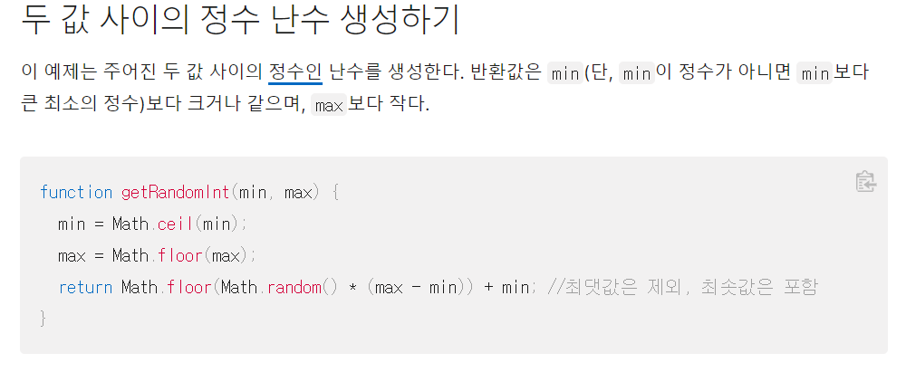
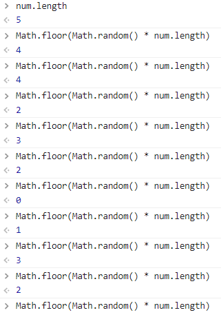
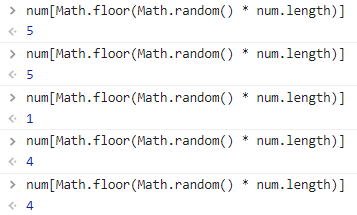
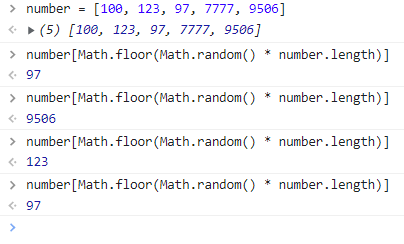
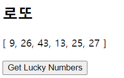
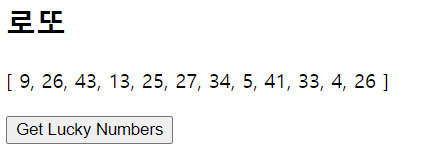

# workshop 어려웠던 점

### 일단 menu list를 만들어서 거기서 랜덤으로 뽑아오려고 했다. 아이디어는 menuIdx를 만들어서 이 랜덤한 인덱스 번호를 만들려고 했다.

1. 처음 접근한거 sample로 뽑아 올려했는데 그런거 없다고 오류

2. 그래서 google에 vue random으로 검색한 결과 Math.random이라는게 나와서 검색해보았다. Math.random()은 0과 1사이의 랜덤값을 반환해준다.

   

이것처럼 인덱스를 활용하기 위해서 이 방법을 사용해보기로 하였다

최소값은 0이고 최대값은 num.length를 사용해보자....

참고로 Math.floor()는 주어진 수 이하의 가장 큰 정수를 반환한다.

0과 1사이의 부동 소수점 * num.length 를 하면

0. xxxxxxxxxxxxxxxx * 5 이다  이 결과는 0과 5사이의 숫자 이므로 

이거를 floor로 하면 0,1,2,3,4 중 하나가 나온다

num = [1, 2, 3, 4, 5] 를 사용해서





인덱스 값과 헷갈려서 num 을 바꿔서 다시 진행



이렇게 랜덤한 숫자가 나온다 !!!!!!!!!11


### lotto 번호를 작성하는데 이게 데이터에 1부터 45까지 다 적어서 하는건 아니라고 생각해서 음,,,, 생각 좀 하다가 일단 배열을 만드는 거니까 나중에 map 쓴다 생각하고 일단 진행해봄 그리고 1부터 45는 for문을 돌까 생각함

- 1부터 45는 처음에 다 넣었다가 lodash생각나서 거기서 _.range(1,46)으로 해결
- 6개를 우째 배열에 넣어줄까 하다가. for문 돌려서 하나씩 넣으면 어떨까 생각해봄

```javascript
number_select: function () {
          // console.log(this.lottoNum)
          // this.lottoNum.map(function (num) {
          //   for (let i=0; i<6; i++) {
          //     return this.lottoNum[ Math.floor(Math.random() * this.lottoNum.length)]
          //   }
          // })
          for (let i=0; i<6; i++) {
            // this.lotto += this.lottoNum[ Math.floor(Math.random() * this.lottoNum.length)] + ','
            this.lotto.push(this.lottoNum[ Math.floor(Math.random() * this.lottoNum.length)])
          }
        }
```

6개씩 뽑는거를 이래 적으니까 6개 나오고 추가해서 6개 나오는 문제점이 발생

- 1번 눌렀을 때
- 
- 2번 눌렀을 때
- 

그래서 초기화를 해줘야겠다고 생각 lotto를 다시 빈 배열로 만들어주었다.

```javascript
number_select: function () {
          // console.log(this.lottoNum)
          // this.lottoNum.map(function (num) {
          //   for (let i=0; i<6; i++) {
          //     return this.lottoNum[ Math.floor(Math.random() * this.lottoNum.length)]
          //   }
          // })
          this.lotto = []
          for (let i=0; i<6; i++) {
            // this.lotto += this.lottoNum[ Math.floor(Math.random() * this.lottoNum.length)] + ','
            this.lotto.push(this.lottoNum[ Math.floor(Math.random() * this.lottoNum.length)])
          }
        }
```

이것으로 초기화 해주는것은 해결하였으나 다른 문제도 인지

번호가 중복해서 나올 수 있다.

-> 배열을 순회해서 있다면 넘기자 먼가 잘 안돌아가네 ㅋㅋㅋ

여러방법 시도했으나 못함 ㅠㅠ


### 처음에 버튼위에 []이렇게 나오는게 보기 싫어서 lotto를 ''을 주었더니 처음에는 나오지 않는다