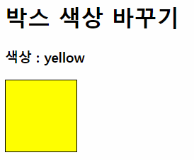

# Practice_01

- box를 클릭하면 box의 배경색이 주어진 색상 중, 무작위로 선택된 하나의 색상으로 변경되도록 코드를 작성하시오.

  - box의 높이와 너비는 100px 입니다.

- Lodash 라이브러리를 활용할 수 있습니다.

- 색상은 red, orange, yellow, green, blue, violet 중 하나가 되도록 작성합니다.

- 완성 예시

  