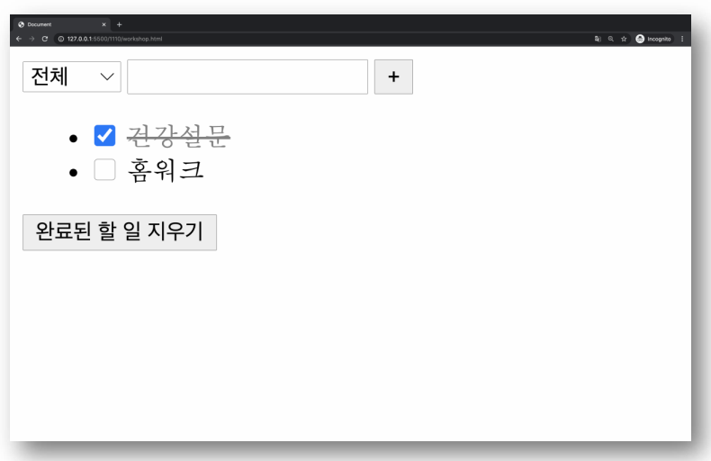

# Practice 04

Vue를 활용하여 todo list 앱을 완성하시오.

- select 요소를 통해 todo list의 상태를 설정할 수 있다.
- 상태 종류 – 전체, 진행중, 완료
- computed를 통해 상태별로 표시되는 todo list를 계산하고, 화면에 todo list를 표시한다.
- Todo item의 체크박스를 통해 할 일의 완료 여부를 설정할 수 있다.
- “완료된 할 일 지우기” 버튼을 누르면 모든 완료된 todo item을 삭제한다.
- Local Storage를 활용하여 브라우저 종료 시에도 데이터가 사라지지 않는다.

