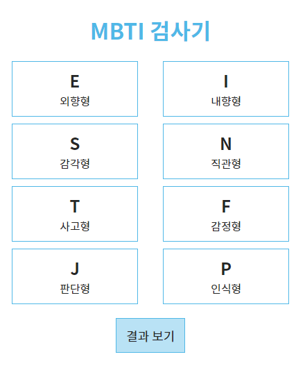
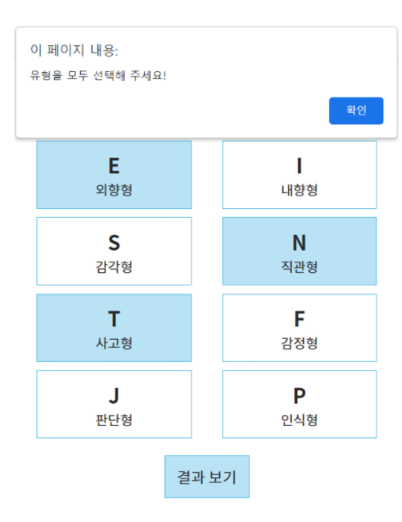
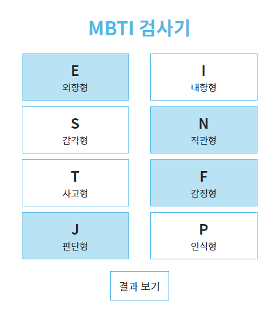

# Practice_05

**내 MBTI 성격 유형 알아보기 Ver 2**

- 예시와 같이 자신의 MBTI 에 해당하는 유형의 버튼을 선택하고, 결과에 대한 설명 페이지로 이동하는 Vue Application 을 작성하시오.
  - MBTI 유형은 각 단락별 한 개씩 총 4개의 값을 종합하여 결정됩니다.
  - 각 단락은 E-I, S-N, T-F, J-P 묶음을 의미하며, E와 I 처럼 한 단락 내의 두 유형은 동시에 선택 될 수 없습니다.
- 버튼이 모두 선택되지 않은 경우, 자신의 MBTI 유형을 확인할 수 없습니다. 버튼을 모두 선택하기 전에는 확인 불가능 Message 를 Alert 합니다.
- 선택된 버튼은 배경 색상이 변경되어 선택되었음을 표기합니다.
  - 같은 단락 내 한 유형이 선택된 상태에서 다른 유형을 선택하는 경우, 기존 유형의 배경색은 제거되고, 새롭게 선택한 유형에 적용됩니다.
  - 데이터 또한 변경 됩니다.
- ex) https://www.16personalities.com/ko/성격유형-intj
- 
- 

