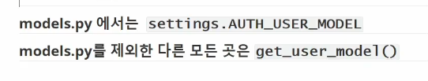

외래키는 클래스에서 맨 위에 적어도 확인해보면 맨 밑에 나온다

우리가 많이 틀릴것들

Comment 모델은 외래키 article_id를 포함합니다.

-->> 외래키는 언더바를 붙여서 이름을 만든다 그러므로 우리는 article에다가 _id를 붙인것이다

article도 소문자 단수형으로 사용해야한다. 1:N관계에서 

`comment.article_id = article.pk`

`comment.article = article`

login_required와 reuire_POST 동시에 사용하면 문제가 생긴다. 둘다 데코레이터

그러므로 login_required를 포기한다. 그럼 무엇을 사용해야하나 --> is_authenticated 사용

### 내가 user 대체하는것을 까먹는다면

https://docs.djangoproject.com/en/4.0/topics/auth/customizing/#substituting-a-custom-user-model

요 3가지 과정 따라하면 된다

맨위에 AUTH_USER_MODEL = 'accounts.User'

### 모델폼과 폼의 차이점 알아보기

### 직접참조하면 유저 대체하면 바로 문제가 생긴다. 

### User 모델 참조하기

삭제 다른줄에 있는거 올리는거 인라인 속성으로 바꿔주기