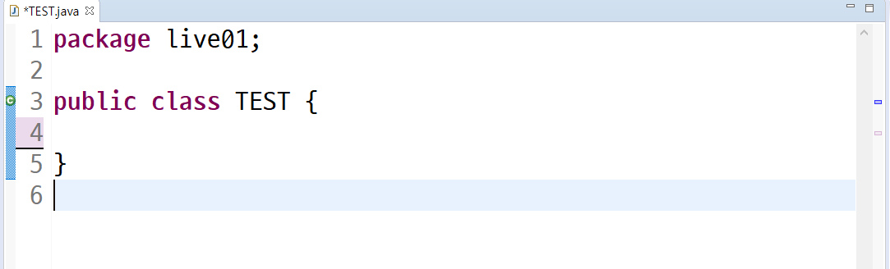
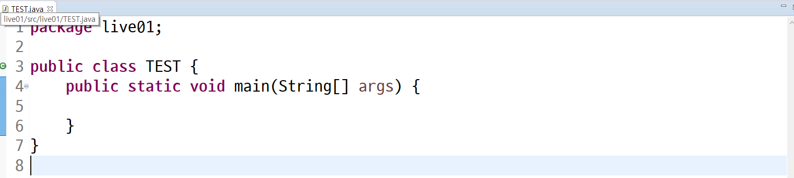

## eclipse 설정

### 1. 상단바의 Window - show view 에 가면 원하는 것들 볼 수 있다. 만약 없거나 안보인다면 Window - show view - other에 들어가서 검색

- 예를 들어 왼쪽에 보이는 Project Explorer를 실수로 껐다면 위 경로에 들어가서 선택해주면 나온다


### 2. 언어 설정

- 우리가 eclipse에서 사용할 언어를 먼저 설정해주자
- `Window - Preferences - General - Workspace`
- 위 경로로 들어가서 Text file encoding을 UTF-8로 설정


- 혹시 폰트나 다른것들을 설정이 필요하다
- `Genreal - Colors and Font - Basic`
- 밑으로 내리다보면 Text Font라는것이 나온다 여기서 수정

- D2CODING을 추천하는 이유 ->> L, I, l, i  이런애들이 안 헷갈린다.

* 그리고 혹시 여기서 자바를 여러개 설치한 사람들이 있따면

- JAVA 폴더에 INSTALLED JREs에 들어가서 zulu선택해라 만약 zulu가 없다??
- add - c - programfile - zulu - zulu선택해라


### 프로젝트 생성 

- project explorer에서 우클릭 new - project
- 자바 프로젝트를 설치하고 finish를 누르면
- Perspective를 열겠냐고 물어본다. -> 이유가 이클립스가 자바만 사용가능한게 아니다
- open Perspective를 누르면 우측 상단에 아이콘이 있따 맨 앞에꺼


- 우리는 보통 JAVA EE 나 JAVA를 사용하는데 둘다 머 상관없다.
- 여기까지 했으면 이제 JRE System Library와 우리가 작성할 source code 가 저장될 src가 생성되었을것이다
- src에 new에서 class를 만들어보자 
- package에는 비어있을 수도 있고 아니면 프로젝트와 이름이 같을 수도 있따. 나중에 소스코드들이 많아지면 그 것들을 관리할 상자라고 생각하자 지금은 넘어가



이러한 화면 생성

`프로그램` : 컴퓨터가 수행해야하는 작업 지침서 이게 어케 생겼는지 알아보자

`ctl + space` 를 많이 활용한다.  안나오면 여러번 해주기

되도록 자동완성을 활용하고 저장을 수시로 해서 활성화되지 않도록해라 --> 나중에 여러 파일을 작업하면 저장이 안되있는 상태에서는 다른 파일의 변경을 인식하지 못하기 때문에


### 저장은 자주 해주기, 자동완성 사용하기


###  실습

- main을 작성하고

- 

- {요거 안에가 우리가 만들 프로그램의 작업 내역서라고 생각하자} -> 여기에 명령어를 넣을것이다.

  

- 가장 간단한 명령어 먼저 해보자 -> 출력

- syso 까지 하고 자동완성하려면 뭘 눌러야한다??? `ctrl + space` 하면 system.out.println(); 을 선택해준다.

- 실행하는 법 

  1. run 버튼
  2. 단축키 : `ctrl +F11`

###  출력문

- print
  - 줄이 안바꾸고 그냥 출력
- println
  - 한줄에 하나씩 출력된다.
  - 출력하고 줄바꾸기
- printf
  - 요거는 print format 서식화된 출력
  - 


### `\` 사용법 

- `\n` : 요거는 줄바꿈 
- `System.out.println("\"")` ---> `"` 요거 출력

- `System.out.println("\\");` ----> `\` 요거 출력


###  주석

- `//` : 한 줄 주석
- `/* */` : 여러 줄 주석 시작 부분에 /*을 하고 */를 만날 때 까지 주석

### 단축키

- 코드 복사 : `ctrl + alt + 위아래`
- 자동완성 : `ctrl + spacebar`
- 주석 처리 : `ctrl + /` 
- 주석 처리 : `crtl + shift + c`
- 정렬(포맷팅) : `ctrl + shift + F`
- 실행 : `ctrl + F11`

```java
package live01;

public class TEST {
	public static void main(String[] args) {
		System.out.println("Hello World");
		System.out.println("Welcome to Saafy");
		System.out.println("\"");
		System.out.println("\\");
		System.out.printf("%d \n", 10); //정수(10진수)
		System.out.printf("%o \n", 10); //정수 (8진수)
		System.out.printf("%x \n", 16); //정수 (16진수)
		System.out.println();
		System.out.printf("%4d \n", 10); // 4칸 확보 후 오른쪽부터 차지
		System.out.printf("%-4d \n", 10); // 4칸 확보 후 왼쪽부터 차지
		System.out.printf("%04d \n", 10); // 4칸 확보 후 오른쪽부터 차지(빈공간은 0)
		
		System.out.printf("%f \n", 10.1); // 실수
		System.out.printf("%.2f \n", 10.1); // 실수(소수점 둘째자리까지)
		
		System.out.printf("%s \n", "배준식"); // 문자열
		
		System.out.printf("%s의 나이는 %d 입니다.", "배준식", 26);
		
        int a;
		a = 10;
		System.out.println(a); // 선언 할당 사용
		
		int b = 20;
		System.out.println(b); // 선언과 동시에 할당하고 사용
		
		int c = a; // 선언과 동시에 할당할건데 a라는 값으로 할당하고
		System.out.println(c); 
		
		c = b; // 중간에 다른값으로 할당하고
		System.out.println(c);
	}
}

```


## 변수

### 변수의 정의

- 데이터를 저장할 메로리의 위치를 나타내는 이름
- 메모리 상에 데이터를 보관할 수 있는 공간을 확보
- 적절한 메모리 공간을 확보하기 위해서 변수의 타입 등장
- `=` 을 통해서 CPU에게 연산작업을 의뢰

 

### 메모리의 단위

- 0과 1을 표현하는 bit
- 8bit = 1byte


### 선언

- 자료형 변수명;
- ex) int age;      String name; 


### 초기화

- 변수명 = 저장할 값;
- ex) age = 30;      name = "철수";


### 선언과 초기화를 동시에

- 자료형 변수명 = 저장할 값;
- int age = 30;


### 변수이름 

- 대소문자를 구분한다.
- 공백은 허용되지 않는다.
- 숫자로 시작할 수 없다.
- '$'와 '_'를 변수이름에 사용할 수 있다. 이외의 특수문자는 허용하지 않는다.
- 예약어(keyword)는 사용할 수 없다.
- 예약어(keyword)란 자바문법을 위해서 미리 지정되어 있는 단어를 의미한다. 아래 목록에 포함되어 있는 단어들은 변수의 이름으로 사용할 수 없다. 

| abstract | default |     if     |   private    |   throw   |
| :------: | :-----: | :--------: | :----------: | :-------: |
| boolean  |   do    | implements |  protected   |  throws   |
|  break   | double  |   import   |    public    | transient |
|   byte   |  else   | instanceof |    return    |    try    |
|   case   | extends |    int     |    short     |   void    |
|  catch   |  final  | interface  |    static    | volatile  |
|   char   | finally |    long    |    super     |   while   |
|  class   |  float  |   native   |    switch    |           |
|  const   |   for   |    new     | synchronized |           |
| continue |  goto   |  package   |     this     |           |


### 자료형

- 기본 자료형과 참조 자료형(기본 자료형 8가지 외 모든 것)
- 기본 자료형(맨 앞의 비트는 부호비트)

|  타입  | 세부타입 |             데이터형             | 크기  |    기본값     |                사용예                 |
| :----: | :------: | :------------------------------: | :---: | :-----------: | :-----------------------------------: |
| 논리형 |          |             boolean              | 1byte |     flase     |           boolean b = true            |
| 문자형 |          |               char               | 2byte | null(￦u0000) | char c = 'a', c1 = 65, c2 = '￦uffff' |
| 숫자형 |  정수형  |               byte               | 1byte |    (byte)0    |             byte b = 100;             |
| 숫자형 |  정수형  |         short(작은정수)          | 2byte |   (short)0    |            short s = 100;             |
| 숫자형 |  정수형  |        int(일반적인정수)         | 4byte |       0       |             int i = 100;              |
| 숫자형 |  정수형  |        long(아주 큰 정수)        | 8byte |      0L       |        long l = 100 l2 = 1000L        |
| 숫자형 |  실수형  |  float(정확도가 떨어지는 실수)   | 4byte |     0.0f      |      float f = 3.1f, f2 = 3.1F;       |
| 숫자형 |  실수형  | double(정확도가 좀 더 높은 실수) | 8byte |     0.0d      |            double d = 3.1;            |