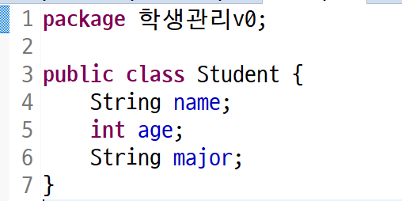

### 클래스를 왜 써야하나??? -----> 아까 설명했던 묶음 도장을 생각해라 예를 들어보자 전화번호 저장할 때 이름 전화번호 소속 이메일 등등 사용하는데

| 이름   | 전화번호       | 소속 | 이메일                 |
| ------ | -------------- | ---- | ---------------------- |
| 배준식 | 010-1234-1234  | 싸피 | qownstlr0394@naver.com |
| 김싸피 | 010-1203-12301 | 싸피 | dhfpdh@naver.com       |

### 여기서 행에 들어있는 데이터를 독립적인 하나 하나의 변수로 관리하는거보다 전체를 하나의 데이터로 정의하고 싶으면 클래스로 정의한다.


### 여러가지 정보를 하나의 정보로 관리하고 싶다면 클래스를 써라 이런 데이터 하나하나가 클래스로 만들어낸 데이터인 객체가 될건데 이 객체가 여러개 있다면 배열이 된다. 


### 실습 시작



### 이렇게 변수를 선언했다고해서 데이터를 담을수 있는 공간이 생긴것이 아니다. class Student로 데이터를 만들어 내면(new 연산자로) 그 만들어진 객체안에 name, age, major 공간이 생긴다.


### Student[] students = new Student[100]; 

### 처음에 이렇게 100개 만들고 만약 나중에 더 많은 인원이 필요하다면???---> 더 큰거를 만들어서 옮겨줘야한다.

### 자 그럼 처음에 100개 있었던거는 어째하냐

### Java의 특징 G.C가 JVM 메모리 공간안에서 안정해진 객체가 있는 영역을 많이 돌아다니다가 저런거를 버린다 근데 언제 버리는지는 모름 


### 이름 비교할때

```java
if (name == data) ----> x 				// 틀린 방법
if (name.equals(students[i].name ) )    // 요게 옳은 방법
```


### 요기서 

```java
int idx = -1;
for(int i = 0; i < size; i++) {
    if ( name.equals(students[i].name)) {
        idx = i;
        break;
    }	
}
```

### 이 코드를 다시 사용해야한는데 우리 이거 또 적을거야??? 아니자나 함수로 만들자 이거 


### static 이거는 뭐하는 친구일까???

- 객체를 만들지 않아도 메모리에 할당이 되는 성질을 가진 아이
- main함수 StudentTest에 객체를 만들지 않고 사용하려고 한거다.


### student 클래스의 역활은 학생정보 하나를 표현

### student 객체가 10개면 10명의 정보를 표현 가능